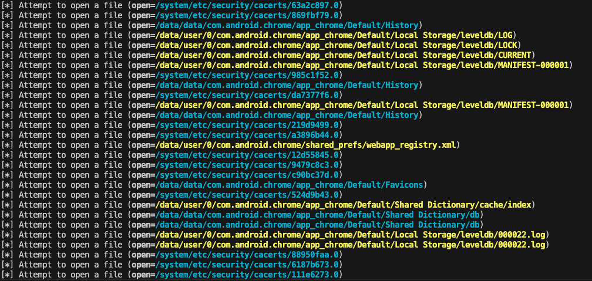

# File API Dump

"**F**ile API **Dump**"

This project observes which files are opened when using file input/output APIs.

## Usage

```shell
$ python3 fdump.py "your.package.name"
```



## How to work

High-level classes (File, FileOutputStream, BufferedReader, etc.) → Low-level system calls (open(), read(), write())
High-level APIs abstract file operations to make them easier for users to handle. However, internally, they ultimately use the Linux open() system call to open the file.